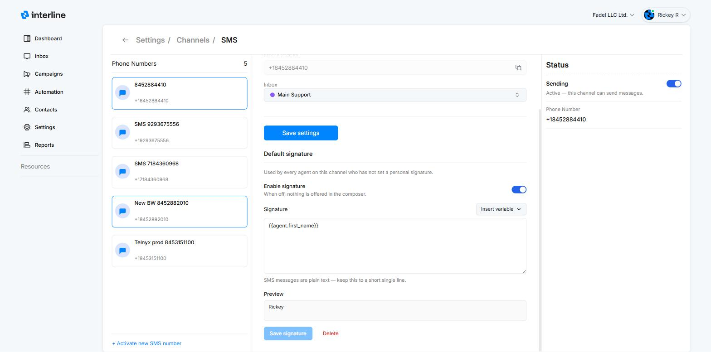

# Channels

Channels are the ways Interline sends and receives messages: **SMS**, **WhatsApp**, and **Email**. You manage them under **Settings → Channels**.

## The Channels page

The Channels page shows a card for each channel type with a quick health summary:

- **SMS** — how many active numbers you have.
- **WhatsApp** — how many active numbers you have.
- **Email** — how many active sending addresses you have.

Expand a card (the chevron) to see its details: a **Channel status** toggle (turn the channel on/off), the number of **active numbers/addresses**, and **total messages today**. Each card also links to that channel's full **settings** (e.g. *WhatsApp Settings*, *Email Settings*) where its numbers/addresses are configured.

## Adding a number or address

Connecting a new SMS number, WhatsApp number, or email address is done from the relevant channel's settings. Because phone numbers and WhatsApp Business accounts require provisioning and verification with the underlying providers, **SMS and WhatsApp channels are typically set up with the Interline team**. **Email is self-serve** — see [Connecting an Email Channel](email-channel.md).

- **SMS** — a phone number capable of sending/receiving texts (and MMS for images).
- **WhatsApp** — a WhatsApp Business number; outbound campaigns use **approved templates** (see [Broadcast](../broadcast/index.md)).
- **Email** — connected self-serve by signing in with the Google or Microsoft account you want to use. See [Connecting an Email Channel](email-channel.md) for the step-by-step guide.

!!! tip "Channel status toggle"
    Use the **Channel status** toggle to pause a channel without removing it — useful during maintenance or if you temporarily stop using a number.

## Default signature

Every channel can carry a **default signature** — a sign-off appended to outgoing messages on that channel. You'll find it in the channel's settings: **Settings → Channels**, open the channel type's settings (e.g. *SMS Settings*), select the number or address, and scroll to **Default signature**.

The default is used by **every agent on that channel who hasn't set a personal signature** of their own — an agent's [personal signature](../agent/signatures.md) always takes priority. Agent variables resolve to whoever is sending, so a single default like `Thanks, {{agent.first_name}} · {{org.name}}` still personalizes itself per agent.

A few things to know:

- Signatures are **plain text** — HTML isn't supported — and they take the same **variables** as personal signatures; see the [variables list](../agent/signatures.md#variables).
- The **Enable signature** toggle controls whether the default is offered at all: when it's off, agents without a personal signature get nothing in the composer.
- The **Preview** shows the resolved result as you type; **Save signature** applies it, and **Delete** removes it from the channel.

{ width="820" }

In the composer, agents see an **Insert signature** checkbox with a preview of what will be appended, and can switch it off for a single message — see [Signatures](../agent/signatures.md#in-the-composer) in the Agent Guide.

## How channels relate to inboxes

Incoming messages on a channel are routed into [inboxes](../agent/mailboxes.md) so your team can work them. Which inbox a message lands in is governed by your [Auto-assign rules](automation.md). When sending a [campaign](../broadcast/index.md) or replying in the [Inbox](../agent/index.md), you choose which channel/number it goes out from.

!!! note
    Exact setup screens for SMS and WhatsApp vary by provider and are being expanded in these docs. If you need a new number connected, reach out to your Interline contact. Email accounts can be connected yourself — see [Connecting an Email Channel](email-channel.md).
