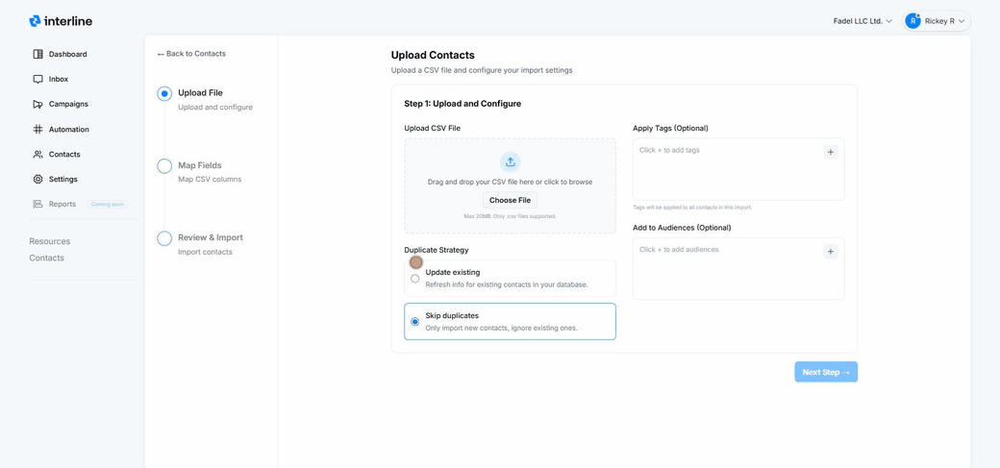

# Importing Contacts

Your contact database lives under **Contacts** in the left navigation. From there you can browse and search contacts, build **audiences** (lists/segments), add a single contact, or **bulk-import** from a CSV file.

## The Contacts page

The **All Contacts** tab shows an overview — total contacts, new contacts, total audiences, and active contacts — followed by a searchable table (name, phone, email, audiences, last contacted). You can filter by channel and date, and open any contact's menu (**⋯**) to view or edit them. The **Audiences** tab manages your lists and segments.

Two buttons sit at the top right: **Add Contact** (one at a time) and **Upload contacts** (bulk CSV import).

## Adding a single contact

Click **Add Contact** and fill in the details — name, phone number(s), email, and any custom fields. This is the same record agents see in the conversation [contact panel](../agent/contacts.md).

## Bulk import from CSV

Click **Upload contacts** to open the import wizard. It has three steps: **Upload File → Map Fields → Review & Import**.

### Step 1 — Upload & configure

- **Upload your CSV** by dragging it in or clicking **Choose File** (max 20 MB, `.csv` only).
- **Apply tags (optional)** — tags added here are applied to *every* contact in this import, which is handy for labeling a batch (e.g. a tag for the event or source the list came from).
- **Add to audiences (optional)** — drop all imported contacts into one or more audiences so they're immediately ready for [campaigns](../broadcast/index.md).
- **Duplicate strategy** — choose what happens when a contact already exists:
    - **Update existing** — refresh the info for contacts already in your database.
    - **Skip duplicates** — only import new contacts and leave existing ones untouched.

Then click **Next Step**.

{ width="820" }

### Step 2 — Map fields

Match the **columns in your CSV** to Interline's contact fields (name, phone, email, custom fields). Good column headers in your file make this quick. Mapping means your spreadsheet's columns don't have to match Interline's field names exactly — you just line them up here.

### Step 3 — Review & import

Review the summary — how many contacts will be created vs. updated — and confirm to run the import. Imported contacts appear in **All Contacts** and in any audiences you selected.

!!! tip "Prep your file first"
    A clean CSV imports best: one header row, a column for phone and/or email, and consistent phone formatting (include the country code, e.g. +1…). Phone or email is what lets Interline message the contact, so make sure at least one is present.

## Audiences

**Audiences** are the lists and segments you send campaigns to — either **Manual** (fixed lists) or **Dynamic** (rule-based, self-updating). You can drop imported contacts straight into an audience during step 1 above. For the full details on creating and using them, see [Audiences](audiences.md).

Tags and audiences are what power targeted [Broadcast](../broadcast/index.md) campaigns and [Keyword](../keywords/index.md) sign-ups, so keeping contacts well-organized pays off when you send. You can also add your own [custom fields and tags](custom-fields.md) to store and segment on business-specific data.
