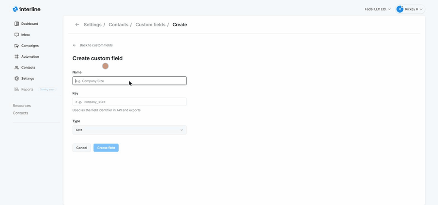

# Custom Fields & Tags

Beyond the built-in contact details (name, phone, email), you can add your own **custom fields** to store information specific to your business — and maintain the shared list of **tags**. Both live under **Settings → Contacts**, which has a **Custom fields** tab and a **Tags** tab.

## Custom fields

Custom fields add extra, structured data to every contact (for example *Company Size*, *Account type*, *VIP status*). The **Custom fields** tab lists each field's **name**, **key**, **type**, and **created** date.

### Creating a custom field

1. Go to **Settings → Contacts → Custom fields** and click **New custom field**.
2. Enter a **Name** — the human-readable label (e.g. *Company Size*).
3. Enter a **Key** — the identifier used in the **API and exports** (e.g. `company_size`). Keep it lowercase with underscores and don't change it later, since integrations rely on it.
4. Choose a **Type** — for example **Text**, **Number**, or **Checkbox** — so the field captures the right kind of value.
5. Click **Create field**.

{ width="760" }

Once created, the field appears on contact records (in the **Contact information** section of the [contact panel](../agent/contacts.md)) where it can be filled in, and it's available for exports and the API.

## Tags

Tags are simple labels you attach to contacts (e.g. **VIP**, **Wholesale**) to categorize and segment them. The **Tags** tab manages the shared tag list for your workspace — create, rename, or remove tags here so everyone uses a consistent set.

Agents apply tags to a contact from the [contact panel](../agent/contacts.md#the-expanded-panel), and tags can also be applied automatically by [keyword campaigns](../keywords/index.md) and [imports](contacts-import.md). Well-maintained tags power targeted [audiences](audiences.md) and [Broadcast](../broadcast/index.md) campaigns.

!!! tip "Custom fields vs. tags"
    Use a **custom field** when you need a *value* (a number, a date, a piece of text). Use a **tag** when you just need a *yes/no label* you can group by. Both help you segment contacts for campaigns.
