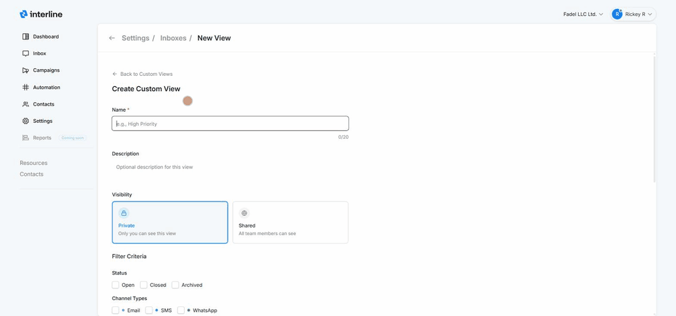

# Custom Views

A **custom view** is a saved, named, filtered list of conversations — for example "High priority", "WhatsApp only", or "My email". Views appear in the **Inbox** left rail under **Custom Views**, giving agents one-click access to the slice of conversations they care about.

Views can be created and managed in two places: from the **Inbox** (the **+ Add View** button in the left rail) and under **Settings → Inboxes → Custom Views**.

## The custom views list

Under **Settings → Inboxes → Custom Views**, each view shows its **name**, **description**, **visibility**, and who **created** it. The row menu (**⋯**) lets you edit or delete a view.

## Creating a custom view

1. Click **New view** (in settings) or **+ Add View** (in the Inbox rail).
2. Enter a **Name** (up to 20 characters) and an optional **description**.
3. Choose **Visibility**:
    - **Private** — only you can see this view.
    - **Shared** — all team members can see and use it.
4. Set the **Filter Criteria** that define which conversations appear:
    - **Status** — Open, Closed, and/or Archived.
    - **Channel types** — Email, SMS, and/or WhatsApp.
    - **Specific channels** — narrow to particular numbers or addresses (e.g. one WhatsApp number).
    - …and other criteria for honing in on exactly the conversations you want.
5. Save. The view appears under **Custom Views** in the Inbox.

{ width="820" }

!!! tip "Good views to create"
    Set up shared views for the slices your whole team uses (e.g. *Awaiting response*, *VIP*, *WhatsApp*), and private views for your own workflow. Because views are just saved filters, they always stay current — new matching conversations show up automatically.

See [Mailboxes & Inboxes](../agent/mailboxes.md) for how custom views fit alongside My Inbox and the shared inboxes in an agent's day.
