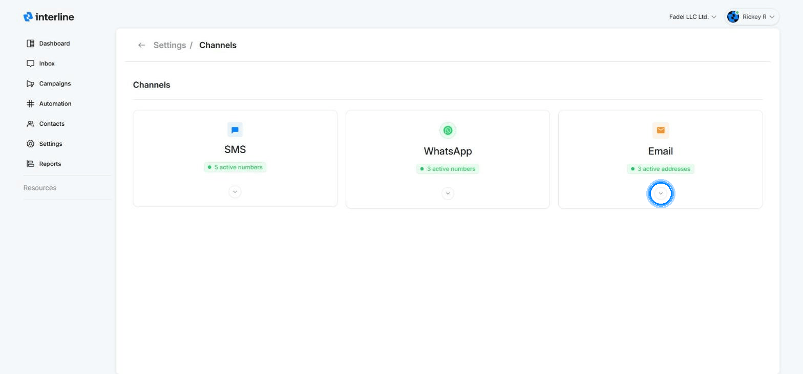
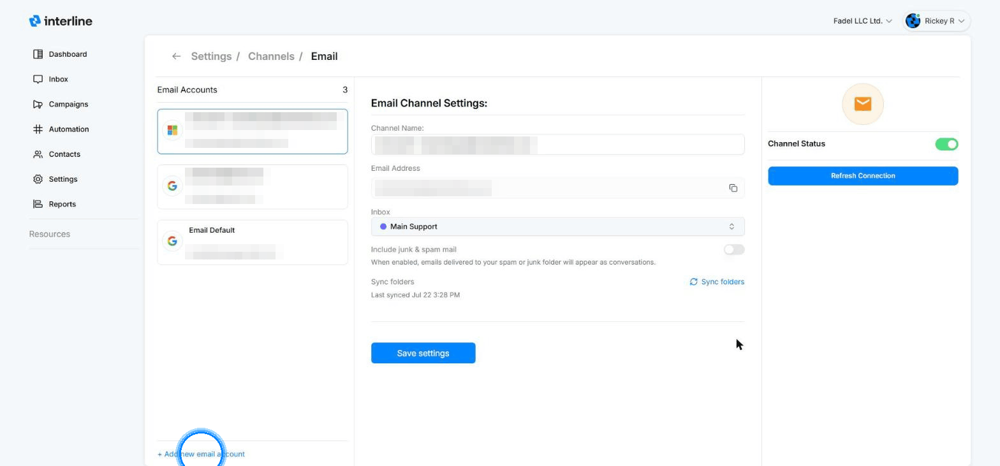
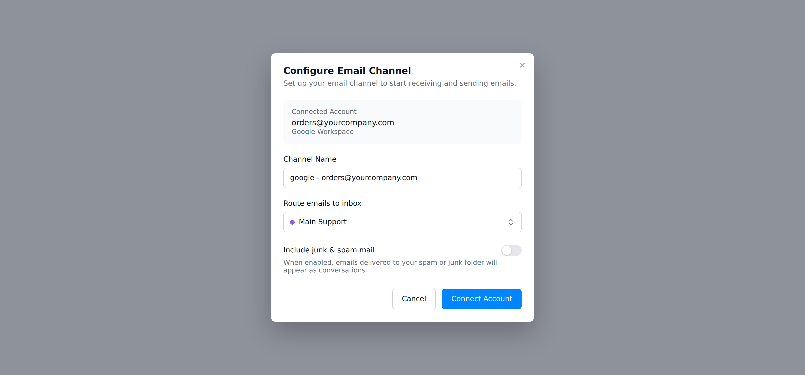

# Connecting an Email Channel

Interline connects directly to your **Google** (Gmail / Google Workspace) or **Microsoft** (Outlook / Microsoft 365) account, so email lands in your Interline inboxes alongside SMS and WhatsApp — and replies go out from your real address.

Connecting takes about two minutes and doesn't require any DNS or IT setup: you sign in with the account you want to connect, and Interline takes care of the rest.

!!! note "Who can do this"
    Connecting channels is done under **Settings**, which requires admin access. You'll also need the login credentials for the email account you're connecting.

## Open the Email channel settings

Go to **Settings → Channels**. You'll see a card for each channel type — SMS, WhatsApp, and Email. Expand the **Email** card (the chevron) to see its health at a glance — channel status, how many addresses are active, and messages sent today — then click **Email Settings**.

{ width="820" }

The Email settings page lists every connected account on the left. Selecting one shows its channel settings: its name, address, which inbox it feeds, and its connection status.

## Connect the account

Click **+ Add new email account** (bottom of the accounts list). A dialog asks which provider the account belongs to — after you sign in, Interline asks how to configure the new channel:

{ width="820" }

=== "Google"

    1. Choose **Sign in with Google**. A Google sign-in window opens.
    2. Pick the Google account you want to connect (or enter its address and password).
    3. Google shows what Interline is asking to access — reading and sending mail on that account. Click **Continue / Allow**.
    4. The window closes on its own and you're back in Interline.

    Works with regular **@gmail.com** addresses and **Google Workspace** addresses on your own domain.

=== "Microsoft"

    1. Choose **Sign in with Microsoft**. A Microsoft sign-in window opens.
    2. Pick the Microsoft account you want to connect (or enter its address and password).
    3. Microsoft shows the permissions Interline is requesting — reading and sending mail on that account. Click **Accept**.
    4. The window closes on its own and you're back in Interline.

    Works with **Outlook.com** addresses and **Microsoft 365** work accounts on your own domain.

!!! tip "Nothing to configure at your provider"
    You're signing in directly with Google or Microsoft, so there are no server addresses, app passwords, or DNS records to set up. Interline never sees your password — the provider only hands Interline a secure token for mail access, which you can revoke at any time from your Google or Microsoft account settings.

## Configure the channel

Once the sign-in succeeds, Interline asks how this account should behave:

{ width="820" }

- **Channel Name** — how this account appears around Interline (channel pickers, settings). Defaults to the provider and address; rename it to something your team recognizes, like *Orders* or *Support*.
- **Route emails to inbox** — which [inbox](inboxes.md) new email conversations land in. You can change this later, or layer on [auto-assign rules](auto-assign.md) for finer routing.
- **Include junk & spam mail** — off by default. When enabled, messages that Google/Microsoft filed as spam also appear as conversations, so nothing legitimate slips through unseen.

Click **Connect Account**. The account appears in your Email accounts list and starts syncing — incoming email shows up as conversations in the inbox you chose, and your team can reply from the [Inbox](../agent/index.md) like any other message.

## After connecting

From the same Email settings page you can, per account:

- **Rename the channel** or move it to a different inbox, then **Save settings**.
- **Toggle Channel Status** to pause the address without disconnecting it.
- **Refresh Connection** if the account was disconnected (for example after a password change at the provider).
- **Sync folders** to pull in the folder list again after changes on the provider side.

!!! note "Disconnecting an account"
    Removing an email account stops new mail from syncing, but existing conversations stay in Interline. You can also revoke Interline's access from your Google or Microsoft security settings — the channel will then show as disconnected until you reconnect it.

## Troubleshooting

- **The sign-in window closed but nothing happened** — pop-ups may be blocked. Allow pop-ups for Interline and try again.
- **Wrong account got connected** — disconnect it, then reconnect and pick the right account in the provider's account chooser.
- **Channel shows as disconnected** — use **Refresh Connection** on the Email settings page. This usually happens after a password change or when your organization's IT revokes third-party access.
- **Microsoft 365 says approval is needed** — some organizations require an IT admin to approve new apps. Ask your Microsoft 365 admin to grant consent for Interline, then sign in again.
