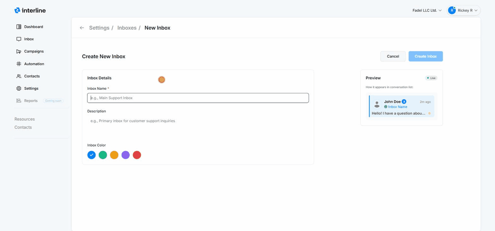

# Inboxes

Inboxes are the shared queues your team works from. Each is a named space (often a team or topic) that members can access to handle conversations. You manage them under **Settings → Inboxes**.

The **Settings → Inboxes** screen has two tabs: **Inboxes** and **[Custom Views](custom-views.md)**. This page covers Inboxes; custom views have their own page.

## The inboxes list

The **Inboxes** tab lists every inbox with its **team name**, **description**, **color**, and **member count**. Each row's menu (**⋯**) lets you edit or remove an inbox. The color is a visual marker that appears next to conversations so agents can tell at a glance which inbox a conversation belongs to.

## Creating an inbox

1. Go to **Settings → Inboxes** and click **New inbox**.
2. Enter an **Inbox Name** (required) — e.g. *Main Support*, *Sales*, *Billing*.
3. Optionally add a **Description**.
4. Pick an **Inbox Color**. A live **Preview** shows how the inbox will look in the conversation list.
5. Click **Create Inbox**.

{ width="820" }

## Adding members

A user's access to an inbox is controlled from **[User Management](users-roles.md)** — when you add or edit a user, you tick the inboxes they should belong to. The inbox list shows how many members each inbox has.

An agent only sees conversations in the inboxes they're a member of — plus any conversation assigned directly to them. See [Mailboxes & Inboxes](../agent/mailboxes.md) for the agent's view.

!!! tip "Structure inboxes around how work is divided"
    Common setups are by **team** (Support, Sales, Billing), by **brand/number**, or by **channel focus**. Then use [Auto-assign rules](automation.md) to route incoming messages to the right inbox automatically.
