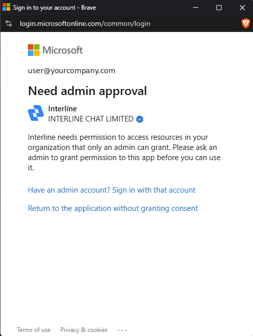
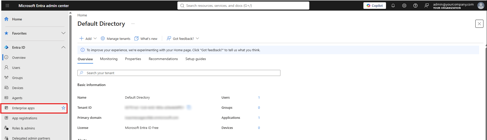
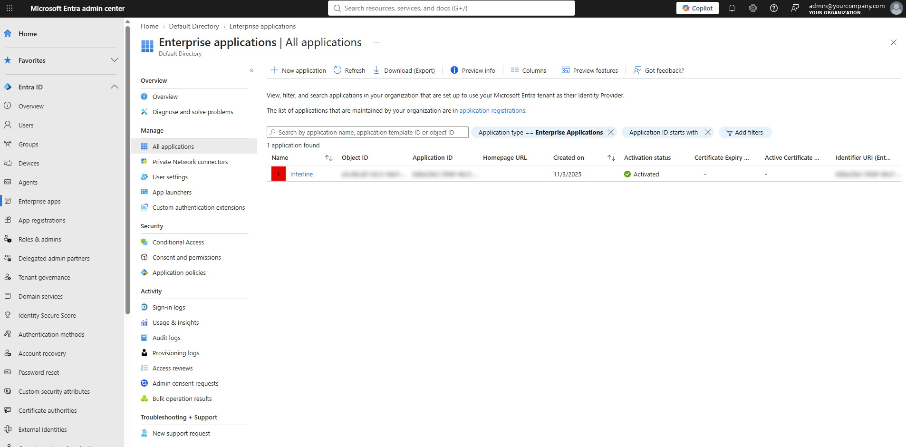

# Microsoft 365: "Need admin approval"

When you connect a **Microsoft 365** work account to Interline, Microsoft may stop the sign-in with a **Need admin approval** screen instead of the usual permissions prompt:

{ width="499" }

> *Interline needs permission to access resources in your organization that only an admin can grant. Please ask an admin to grant permission to this app before you can use it.*

This isn't an error on Interline's side. Many organizations configure Microsoft 365 so that employees can't approve new apps themselves — an admin has to allow the app for the company first. Once that's done, connecting works exactly as described in [Connecting an Email Channel](email-channel.md).

!!! note "Who this applies to"
    Only **Microsoft 365 work or school accounts** managed by an organization. Personal **Outlook.com** accounts never require admin approval.

## What to do as the user

The screen looks slightly different depending on how your organization set things up. Match yours:

**You see a *Request approval* button.**
Your organization allows approval requests. Click **Request approval**, add a short note (for example *"Connecting our support mailbox to Interline"*), and submit it. Your admin gets an email from Microsoft, reviews it, and approves. Then come back to Interline and sign in with Microsoft again.

**You see *Have an admin account? Sign in with that account* (as in the screenshot above).**
Approval requests are turned off in your organization, so you can't request one yourself. Send this page to your Microsoft 365 admin — the [For admins](#for-microsoft-365-admins) section below has what they need to click. Or, if an admin is sitting next to you, they can click that link, sign in with their admin account, and approve on the spot (see *Approve right from the sign-in screen* below).

Either way, once consent is granted: go back to Interline (**Settings → Channels → Email Settings → + Add new email account**), choose **Sign in with Microsoft**, and sign in again. This time Microsoft lets you through.

---

## For Microsoft 365 admins

Interline is a **publisher-verified** app (Interline Chat Limited) that asks only for permission to **read and send mail** on the mailbox being connected. It doesn't request access to files, calendars, contacts, or other users' mailboxes.

The steps below use the **Microsoft Entra admin center** ([entra.microsoft.com](https://entra.microsoft.com/)). The same pages exist in the Azure portal ([portal.azure.com](https://portal.azure.com/)) under **Microsoft Entra ID → Enterprise applications**. You need at least the **Cloud Application Administrator** role (Global Administrator also works).

There are three ways to grant consent. Pick whichever fits:

### Approve right from the sign-in screen

Fastest if you're with the user. On the **Need admin approval** screen, click **Have an admin account? Sign in with that account**, sign in with your admin account, tick **Consent on behalf of your organization**, and click **Accept**. Done — the user can now sign in.

### Approve a pending request

Use this when a user clicked **Request approval**. (Microsoft's own guide: [Review admin consent requests](https://learn.microsoft.com/en-us/entra/identity/enterprise-apps/review-admin-consent-requests).)

1. Sign in to the [Microsoft Entra admin center](https://entra.microsoft.com/) as a Cloud Application Administrator who is a designated reviewer.
2. Go to **Entra ID → Enterprise apps**.

    { width="820" }

3. Under **Activity**, select **Admin consent requests**.
4. Open the **My Pending** tab and select **Interline**.
5. Click **Review permissions and consent** to see what's being requested. The **Requested by** tab shows who asked and why.
6. Click **Approve**. All requestors are notified, and everyone in your tenant can now connect their mailbox to Interline.

    *Deny* lets users request again later; *Block* prevents any future requests for this app.

!!! warning "Reviewers only see requests made after they were designated"
    If the request isn't showing under **My Pending**, it may have been submitted before you were added as a reviewer. Use the direct-consent method below instead.

### Grant consent directly (no request needed)

Use this when users can't submit requests, or to allow Interline ahead of time.

1. In the Entra admin center, go to **Entra ID → Enterprise apps → All applications**.
2. Search for **Interline** and open it.

    { width="820" }

    If it isn't listed yet, have one user attempt the sign-in from Interline first — that registers the app in your tenant — then **Refresh** the list.

3. In the app's left menu, open **Security → Permissions**.
4. Click **Grant admin consent for _&lt;your organization&gt;_**, sign in if prompted, and click **Accept**.
5. Tell the user to connect their account in Interline again.

??? info "Optional: restrict which users can connect"
    If you'd rather not allow every user, open the Interline app under **Enterprise apps**, go to **Properties**, and set **Assignment required?** to **Yes**. Then under **Users and groups**, add only the people who should be able to connect a mailbox. Anyone else will be blocked at sign-in.

### Let users request approval in the future

If your users are seeing the version of the screen *without* a **Request approval** button, the admin consent workflow is off. Turning it on means the next app request comes to you as an email instead of a dead end for the user. (Microsoft's guide: [Configure the admin consent workflow](https://learn.microsoft.com/en-us/entra/identity/enterprise-apps/configure-admin-consent-workflow).) Requires **Global Administrator**.

1. Go to **Entra ID → Enterprise apps → Consent and permissions → Admin consent settings**.
2. Under **Admin consent requests**, set **Users can request admin consent to apps they are unable to consent to** to **Yes**.
3. Choose **who can review** requests (users, groups, or roles), whether reviewers get **email notifications**, and how many days until a request **expires**.
4. Click **Save**. It can take up to an hour to take effect.

### Or: let users approve apps themselves

Some organizations prefer to let users consent on their own, at least for verified publishers:

1. Go to **Entra ID → Enterprise apps → Consent and permissions → User consent settings**.
2. Under **User consent for applications**, choose **Allow user consent for apps from verified publishers, for selected permissions** (Microsoft's recommended setting — Interline qualifies) or **Allow user consent for apps**.
3. Click **Save**. Users can now accept Interline's permissions prompt themselves.

---

## Still stuck?

If a user still sees the approval screen after consent was granted:

- Make sure the user is signing in with the **same organization's** account that consent was granted in — consent is per tenant.
- Have the user close all Microsoft sign-in windows and start the connection again from Interline.
- If **Assignment required?** is turned on for the app, confirm the user has been added under **Users and groups**.
- Admins can see exactly why a sign-in was refused under **Entra ID → Monitoring & health → Sign-in logs**. Filter by the user's address and the time of the attempt — the **Failure reason** column explains what blocked it.

If that doesn't resolve it, contact Interline support with the user's email address, the approximate time of the attempt, and the failure reason from the sign-in log.
