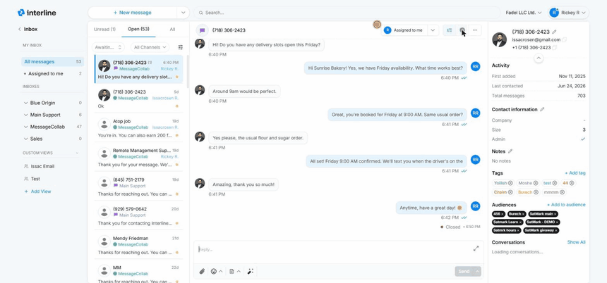

# Team Collaboration

The Inbox is a shared workspace, so the most important thing is that the team stays coordinated — no two people replying to the same client, and nothing dropped because everyone assumed someone else had it. Interline handles this with assignment, internal comments, and a clear closing flow.

## Assigning conversations

Assigning a conversation makes one person responsible for it. Once assigned, it appears under that person's **Assigned to me** in [My Inbox](mailboxes.md), signaling to the rest of the team that it's being handled. The **assigned person's name is shown right on the conversation row** in the list, so anyone scanning the queue can instantly see who owns what.

Use assignment to hand a conversation to the right specialist, to claim a conversation you're taking on yourself, or to triage a shared inbox by distributing its conversations to individual owners.

## Internal comments

Internal comments are notes you leave **on a conversation that the client never sees**. They're for the team only.

Use them to add context before handing a conversation off (“Spoke to this client yesterday, they're waiting on a quote”), to ask a colleague a question, or to record a decision. Comments appear inline in the conversation history, visually distinct from the actual messages so there's no risk of confusing an internal note with a client reply.

### @mentions

Within an internal comment you can **@mention** a teammate. Mentioning someone tags them on the conversation and notifies them, so you can pull the right person in directly — for example, looping in a manager on an escalation, or asking the colleague who owns an account to weigh in.

!!! tip
    Internal comments + @mentions replace the side-channel of Slack messages and forwarded emails. Keeping the discussion *on the conversation* means the full context lives in one place, and the next person to pick it up sees the whole story.

## Closing a conversation

When a conversation is fully handled, **close** it. Closing does two things:

1. It takes the conversation out of the active queue, so it's not cluttering the Open and Unread views.
2. It **un-assigns the conversation from you**, releasing your ownership.

This keeps your **Assigned to me** clean — once you've finished with something and closed it, it's off your plate. If the client replies again later, the conversation reopens and re-enters the queue.

Use the green **Close conversation** check at the top of the thread. It immediately drops out of the Open queue (and the count ticks down):

{ width="760" }

!!! note "Closing isn't deleting"
    A closed conversation isn't gone — it's archived and fully searchable, and it reopens automatically if the client messages again. Closing simply means “done for now.”

## A typical team workflow

1. Messages arrive in a **shared inbox**.
2. An agent triages **Unread**, reading and setting **priority** and **tags** as needed.
3. Each conversation is **assigned** to whoever should own it (or the agent handles it directly).
4. The owner replies, using **internal comments** and **@mentions** to pull in help when needed.
5. When the client's need is met, the owner **closes** the conversation — clearing it from the queue and releasing the assignment.

Next: [Contacts](contacts.md).
