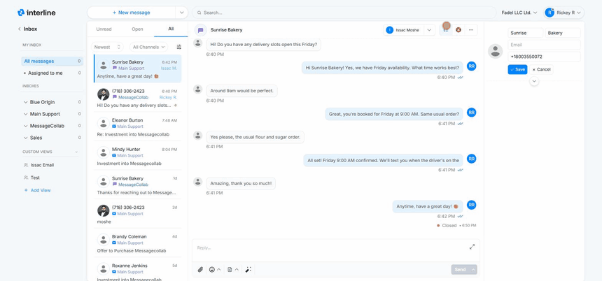
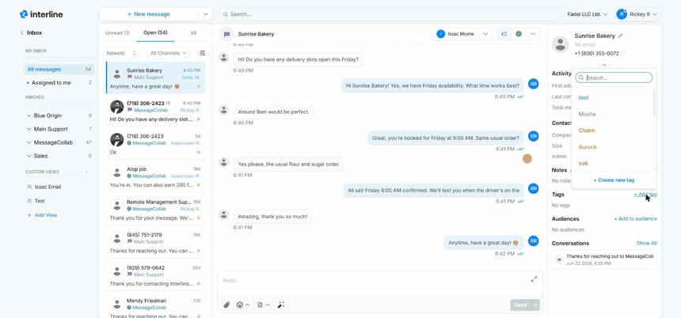

# Contacts

Every conversation is with a contact, and Interline keeps that contact's details right beside the conversation so you always have context while you reply.

## The contact panel

When you open a conversation, the **contact details panel** appears alongside it. It shows who you're talking to — their name, the channels you can reach them on (phone number, email), and other details on file. Having this in view means you don't have to leave the conversation to remember who a client is or how else to reach them.

## Saving a name on reply

When a message comes in from a number or address that isn't yet in your contacts, the conversation shows the raw phone number or email. The first time you reply, Interline **prompts you to save the sender's name** to a contact.

Saving the name is a small habit with a big payoff: from then on the conversation — and the whole inbox list — shows a real name instead of a string of digits, which makes everything far easier to scan and search.

!!! tip
    Save the name even if you only have a first name or a company name. Anything is more recognizable than a phone number, and you can fill in the rest of the details later.

## Contact details

A contact record can hold the information your team needs to recognize and serve the person — their name, phone number(s), email, and the tags or list memberships that apply to them. Those tags and lists are what [Broadcast](../broadcast/index.md) uses to decide who receives a campaign, and what [Keywords](../keywords/index.md) can add people to automatically.

To edit a contact, click the **pencil** icon in the contact panel, update the fields, and **Save** — the new name updates everywhere it appears (the panel, the conversation header, and the list):

{ width="760" }

## The expanded panel

Expand the contact panel (the chevron below the name) to see the full record. It's organized into sections:

- **Activity** — at-a-glance history: when the contact was **first added**, when they were **last contacted**, and the **total messages** exchanged.
- **Contact information** — the core fields plus any custom fields your team uses (for example *Company*, *Size*, or *Admin*). Click the pencil to edit.
- **Notes** — free-text notes about the contact that stay internal to your team (never sent to the client). Use them for context like preferences or account history.
- **Tags** — labels that categorize the contact (e.g. **VIP**). Tags are shared across your team and drive filtering and audience building.
- **Audiences** — the contact lists/segments this person belongs to, which [Broadcast](../broadcast/index.md) uses to decide who receives a campaign.
- **Conversations** — a quick history of this contact's other threads, so you can jump to past interactions.

### Adding tags and notes

To **tag** a contact, click **+ Add tag**, search for a tag (or create a new one), and press the **+** to apply it. To add a **note**, click the pencil next to Notes, type your note, and **Save**. Both update instantly:

{ width="760" }

!!! tip
    Tags and audiences aren't just labels — they're what powers targeted [Broadcast](../broadcast/index.md) campaigns and [Keywords](../keywords/index.md) sign-ups. Keeping contacts well-tagged pays off when you send.

!!! note "Managing contacts in bulk"
    Adding and editing a contact happens right here in the conversation, but importing contacts in bulk (for example from a CSV) and managing the full contact database is an admin task. See the [Admin Guide](../admin/index.md).

Next: [Notifications](notifications.md).
