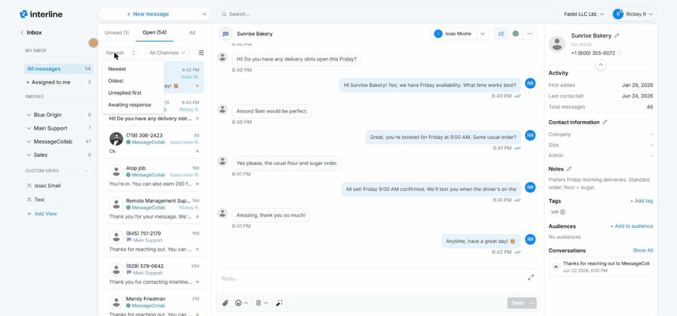

# Mailboxes & Inboxes

The left sidebar is how you choose *which* conversations you're looking at. It's organized into three groups: **My Inbox**, **Inboxes**, and **Custom Views**. Each entry shows a count of conversations so you can see where work is waiting.

## My Inbox

This group is about *you*.

**All messages** shows every conversation you can see in one place. That means all conversations from all the [inboxes](#inboxes) you have access to — *plus* any conversation that's been **assigned to you from an inbox you don't have access to**. So if a teammate hands you a conversation that lives in an inbox you're not a member of, it still shows up here under All messages. It's the one view guaranteed to include everything that's yours or visible to you.

**Assigned to me** narrows that down to only the conversations currently assigned to you — your personal to-do list, regardless of which inbox each one came from.

!!! tip "Start your day here"
    **Assigned to me** is what you personally owe a response on. **All messages** is the wider pool you and the team are working from. Most agents check *Assigned to me* first, then help clear *All messages*.

## Inboxes

Below My Inbox is the list of **shared inboxes** you're a member of (for example *Main Support*, *Sales*, or a team- or brand-specific inbox). Each inbox is a shared queue: everyone with access to it sees the same conversations and can pick them up.

Click an inbox to focus on just its conversations. New incoming messages land in the appropriate inbox based on how your workspace is configured, and the team works them from there.

!!! note "Access matters"
    You only see the inboxes you've been given access to. A conversation assigned to you from an inbox you *aren't* a member of won't appear under that inbox for you — but it will still appear under **All messages** and **Assigned to me**.

## Custom Views

**Custom Views** are saved, filtered lists (for example a view for a specific channel or a particular slice of conversations). Use **+ Add View** to create one — you can keep it private or share it with the team. They're a convenient shortcut to a set of conversations you return to often. See [Custom Views](../admin/custom-views.md) for the full details.

## Tabs: Unread, Open, All

Across the top of the conversation list are three tabs that filter by status:

- **Unread** — conversations with messages no one has read yet.
- **Open** — active conversations that still need attention.
- **All** — everything, including closed conversations.

More on status in [Organizing Conversations](organizing.md).

## Sorting and channel filter

Above the list you can **sort** the conversations four ways:

- **Newest** — latest activity on top. Best for staying current.
- **Oldest** — longest-waiting first, so nothing slips through.
- **Unreplied first** — conversations that haven't been replied to yet, bumped to the top.
- **Awaiting response** — conversations where the client sent the last message and the team still owes a reply.

You can also **filter by channel** with the **All Channels** dropdown — switch to just SMS, just WhatsApp, or just email when you want to focus on one channel.

{ width="760" }

## Reading the conversation list

Each row in the list packs in several signals at a glance:

- **Contact name or number** — who the conversation is with (save a name so it isn't just a phone number — see [Contacts](contacts.md)).
- **Channel badge** — which inbox/channel the conversation belongs to.
- **Assigned name** — the name shown on the row tells you **who the conversation is currently assigned to**, so you can instantly see who owns it.
- **Yellow dot** — indicates the conversation is **open** (still active). It's a quick visual cue for what's outstanding versus what's been closed.
- **Timestamp** — when the last message arrived.

Next: [Reading & Replying](reading-and-replying.md).
