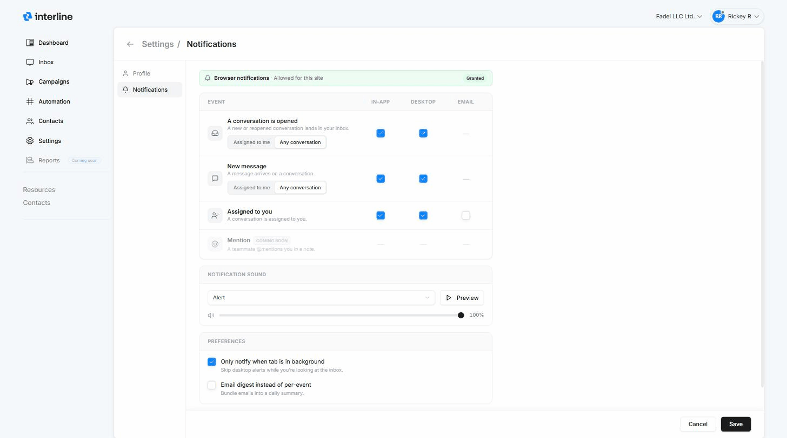

# Notifications

Notifications keep you on top of what needs your attention without constantly scanning the queue. You control your own alerts on the **Notifications** settings page.

## Opening notification settings

Click your **profile avatar** in the top-right corner and choose **Notifications** (you'll land on **Settings → Notifications**). These settings are **personal** — each user configures their own; they don't affect teammates.

{ width="820" }

## Allow browser notifications first

The banner at the top shows whether your browser has **granted permission** for desktop alerts. When it reads **Granted** (*Allowed for this site*), you're set.

!!! warning "Turn on browser notifications to get desktop alerts"
    Desktop alerts **only work if your browser allows notifications for Interline**. The first time you enable a Desktop toggle, your browser will ask for permission — click **Allow**. If you previously blocked it, the banner won't say *Granted*; open your browser's site settings (the padlock/site icon in the address bar → **Notifications → Allow**) and reload. Until permission is granted, In-app alerts still work but nothing will pop up on your desktop.

## Choosing what notifies you — and how

The main table lets you turn each **event** on or off across three delivery methods:

- **In-app** — a badge/alert inside Interline while you're using it.
- **Desktop** — a browser push notification, so you're alerted even when Interline isn't the active tab (requires browser permission above).
- **Email** — an email notification.

The events are:

| Event | What it means | Scope |
|-------|---------------|-------|
| **A conversation is opened** | A new or reopened conversation lands in your inbox. | **Assigned to me** or **Any conversation** |
| **New message** | A message arrives on a conversation. | **Assigned to me** or **Any conversation** |
| **Assigned to you** | A conversation is assigned to you. | — |
| **Mention** *(coming soon)* | A teammate @mentions you in a note. | — |

For **A conversation is opened** and **New message**, use the **Assigned to me / Any conversation** toggle to decide how broadly you're alerted — only your own conversations, or everything coming into the inboxes you can see.

!!! note "Delivery availability"
    Not every method is available for every event yet — where a method isn't offered, it shows a dash (—). Currently **Email** is available for **Assigned to you**, and the **Mention** event is **coming soon**.

## Notification sound

Under **Notification sound** you can pick the sound that plays for in-app/desktop alerts (for example *Alert*), **Preview** it, and set the **volume**.

## Preferences

Two extra options fine-tune the noise:

- **Only notify when tab is in background** — skip desktop alerts while you're actively looking at the inbox, so you're only pinged when you've stepped away.
- **Email digest instead of per-event** — bundle email notifications into a single **daily summary** rather than one email per event.

## Save

Adjust the toggles, sound, and preferences, then click **Save**. **Cancel** discards your changes.

!!! tip "A sensible starting point"
    Keep **in-app** and **desktop** on for *Assigned to you* and *New message → Assigned to me* so you never miss your own conversations, turn on **Only notify when tab is in background** to cut noise while you're working, and reach for **Any conversation** only if you're actively triaging a shared inbox.

!!! note "Agent vs. workspace settings"
    This page covers *your* notifications. Workspace-wide settings live in the [Admin Guide](../admin/index.md).

---

That's the full Agent Guide. If you also handle setup, campaigns, or team management, head to the [Admin Guide](../admin/index.md).
