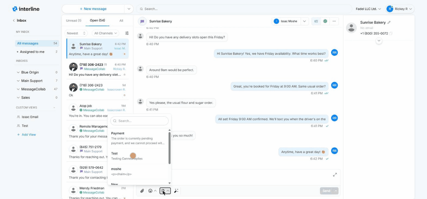

# Reading & Replying

This is the core of inbox work: open a conversation, read the history, and send a reply. This guide covers the reply editor and the tools that make replying faster.

## Opening a conversation

Click any conversation in the list to open it in the detail panel on the right. You'll see the full message history with the contact — every message in and out, in order, with timestamps. The most recent message is at the bottom, and the reply editor sits below it.

The channel of each conversation is shown by its icon (email, SMS, or WhatsApp), so you always know how your reply will be delivered.

## The reply editor

Type your reply in the editor at the bottom of the conversation, then send.

For **email** conversations the editor is a **rich text editor** — you can format with bold, italics, lists, and links, just like composing a normal email.

For **SMS and WhatsApp**, formatting is simpler because the channels themselves are plain text (WhatsApp supports light formatting like bold and italics; SMS is plain). Interline shows the editor appropriate to the channel you're replying on.

!!! tip "Saving a contact's name"
    The first time you reply to a new sender, Interline prompts you to **save their name to your contacts**. Do it — next time the conversation shows a name instead of a raw phone number or email address, which makes the whole inbox easier to scan. See [Contacts](contacts.md).

## Canned replies

Canned replies are pre-written messages you can drop into the editor instead of typing the same thing over and over — things like “Thanks, we've received your order and will confirm shortly.”

To use one, open the canned-reply picker from the reply editor and choose the reply you want. It's inserted into the editor, where you can edit it before sending.

Canned replies can include **{variables}** — placeholders like `{first_name}` that fill in automatically with the contact's details, so a canned reply still reads as personal. Your admin manages the shared library of canned replies; see [Canned Replies](../admin/canned-messages.md).

{ width="760" }

## Attachments

You can attach files to your replies — images, PDFs, and other documents.

- **Upload from your device** the same way you'd attach a file to an email.
- **Pick from the cloud library** — a shared store of files your team uses often (price lists, brochures, forms), so you don't have to hunt for the same file each time.

!!! note "Channel limits"
    What can be attached depends on the channel. Email handles most file types and larger sizes. SMS and WhatsApp have stricter limits on file type and size, and images may be sent as MMS on SMS. If an attachment can't be delivered on a given channel, Interline will let you know.

## Delivery status

After you send, Interline shows the message's delivery state so you know it went through. A **delivered checkmark** appears on a message once the channel confirms it reached the recipient. If a message fails to deliver, it's flagged so you can follow up — for example by trying a different channel.

## Awaiting response

Conversations where the **client** sent the last message — meaning the ball is in your court — are marked as **awaiting response**. This makes it easy to see at a glance which conversations still need a reply from your team versus which are waiting on the client. More on this in [Organizing Conversations](organizing.md).

Next: [Organizing Conversations](organizing.md).
