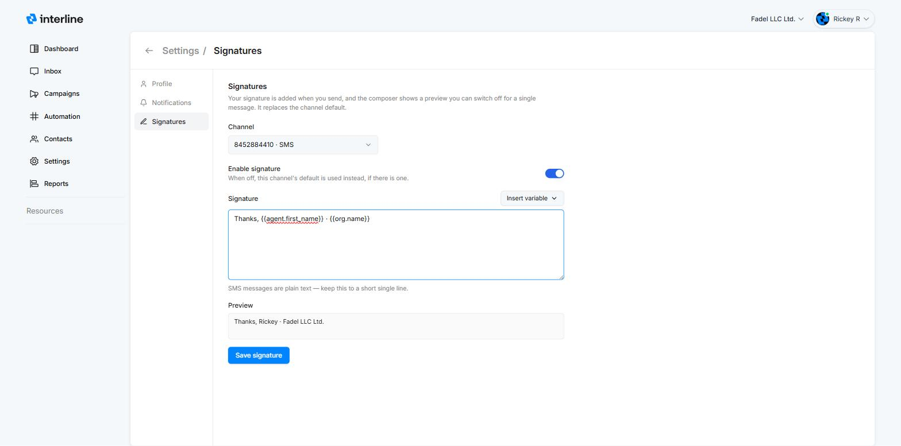
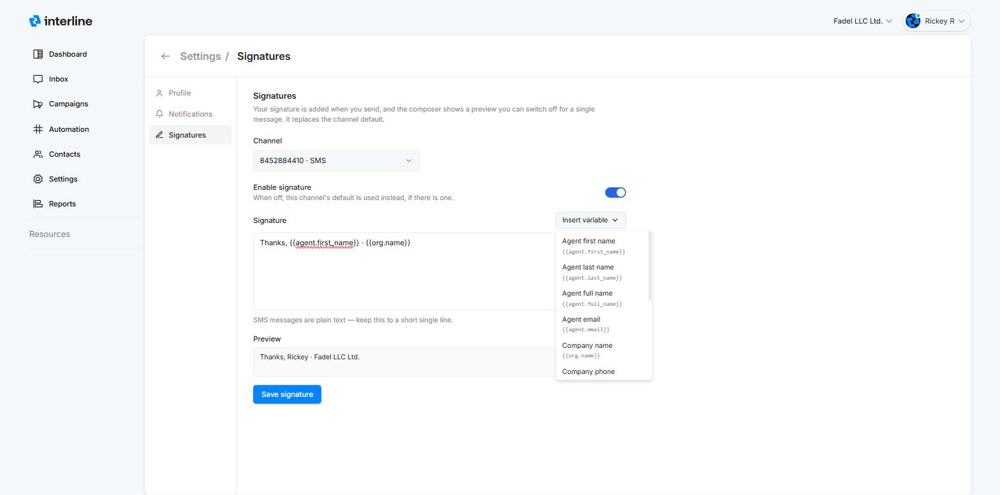
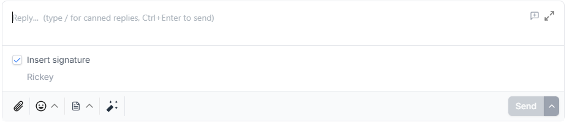

# Signatures

A signature is a short sign-off that Interline adds to your outgoing messages — your name, your company, maybe a phone number or website. Set it once and it's appended automatically when you send, so every reply goes out consistent and professional.

Signatures come in two levels:

- **Your personal signature** — set by you, for you, under your profile. This page covers it.
- **A channel's default signature** — set by an admin on a channel, and used by every agent on that channel who hasn't set a personal signature of their own. See [Default signature](../admin/channels.md#default-signature) in the Admin Guide.

If you have a personal signature on a channel, it **replaces that channel's default**.

## Setting your personal signature

Click your name (top right) → **View profile** → **Signatures**.

1. Pick the **Channel**. Signatures are per channel, so you can sign emails one way and texts another — a fuller signature on email, a short one on SMS.
2. Turn on **Enable signature**.
3. Type your signature. Use the **Insert variable** menu to drop in dynamic values like your name or the company website (see [Variables](#variables) below).
4. The **Preview** below the editor shows exactly how it will read, with the variables filled in.
5. Click **Save signature**, then repeat for any other channels you send from.

{ width="820" }

!!! note "Turning it off"
    If you switch **Enable signature** off for a channel, the channel's default signature is used instead — if the admin has set one.

## Variables

Signatures are **plain text** — HTML isn't supported — but they can include **variables**: placeholders that fill in automatically when the message is sent. Insert them from the **Insert variable** menu, or type them directly.

{ width="820" }

| Variable | Fills in with |
| --- | --- |
| `{{agent.first_name}}` | Your first name |
| `{{agent.last_name}}` | Your last name |
| `{{agent.full_name}}` | Your full name |
| `{{agent.email}}` | Your email address |
| `{{org.name}}` | Company name |
| `{{org.phone}}` | Company phone |
| `{{org.email}}` | Company email |
| `{{org.website}}` | Company website |
| `{{org.address}}` | Company address |
| `{{org.city}}` | Company city |
| `{{org.state}}` | Company state or region |
| `{{org.country}}` | Company country |

Company values come from your [Company Settings](../admin/company-settings.md), so a signature like `Thanks, {{agent.first_name}} · {{org.name}}` stays correct even if details change later.

## In the composer

When a signature applies to the conversation's channel, the reply editor shows an **Insert signature** checkbox with a preview of the signature underneath. It's checked by default — the signature is appended to your message when you hit send.

Sending something quick where a sign-off would feel out of place? **Uncheck it for that one message.** Your saved signature isn't affected.

{ width="760" }

!!! tip "Keep SMS signatures short"
    SMS messages are plain text and every character counts, so keep your SMS signature to a short single line — `Thanks, {{agent.first_name}} · {{org.name}}` does the job better than a four-line block.
