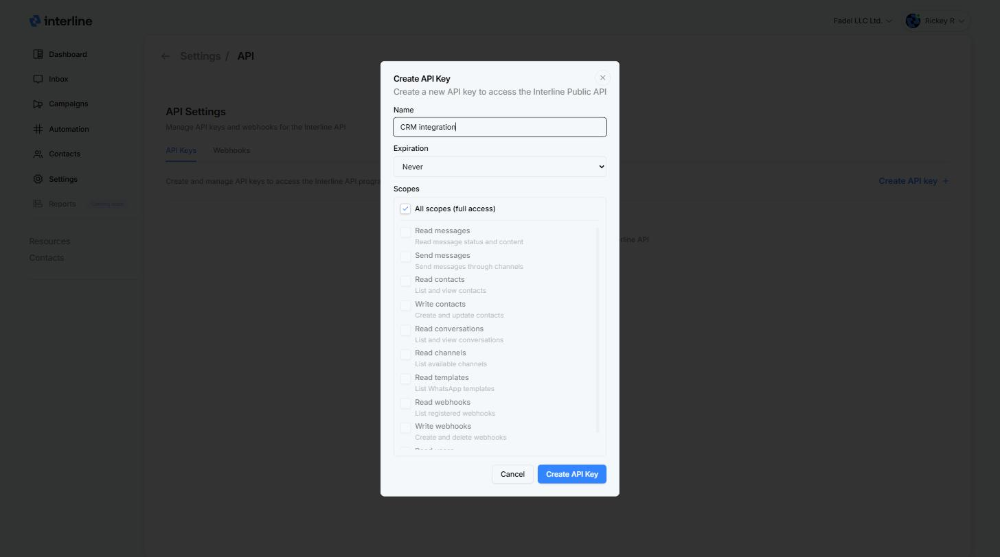
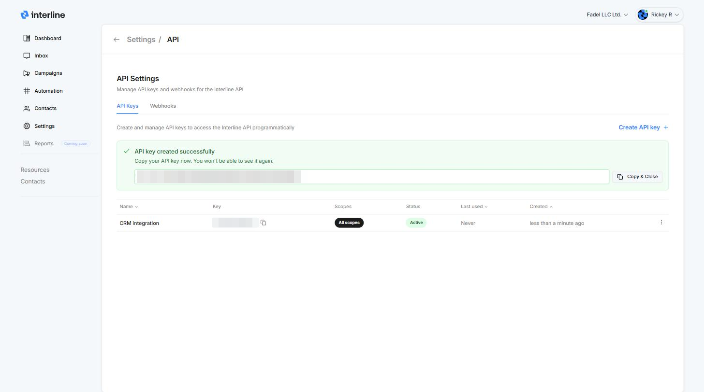
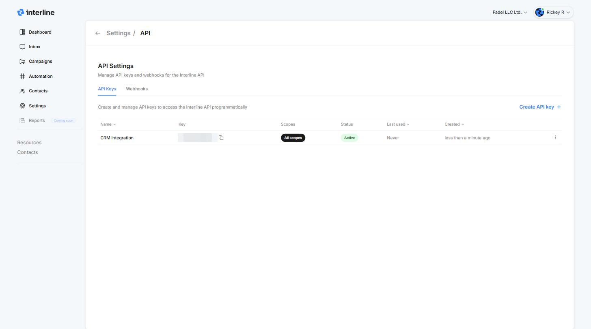

# API Overview

The Interline API lets you integrate Interline with your own systems — send and receive messages across SMS, WhatsApp, and email, manage contacts and audiences, and trigger broadcasts programmatically.

[Open the API Reference :material-arrow-right:](reference.md){ .md-button .md-button--primary }

The reference is interactive — browse every endpoint, see request/response schemas, and try calls directly from the page.

## Create an API key

1. Go to [**Settings → API**](https://app-ui.interline.chat/settings/api). The **API Keys** tab opens by default.
2. Click **Create API key**.
3. Give the key a descriptive name (e.g. "CRM integration"), pick an expiration, and choose its scopes.
4. Click **Create API Key**.

{ width="760" }

**Expiration** — keys can live forever (**Never**) or expire automatically after **7 days**, **30 days**, **90 days**, or **1 year**. Expiring keys are a good habit for short-lived integrations and testing.

### Copy your key — it's shown only once

As soon as the key is created it's displayed at the top of the page. Click **Copy & Close** and store it somewhere safe — for security, Interline never shows the full key again. If you lose it, revoke the key and create a new one.

{ width="760" }

!!! warning "Keep your key secret"
    Anyone with your API key can act on your account within the key's scopes. Never commit it to source control or expose it in client-side code. If a key leaks, revoke it from [Settings → API](https://app-ui.interline.chat/settings/api) and create a new one.

## Scopes

Scopes control what a key is allowed to do. **All scopes (full access)** is selected by default — untick it to grant only what your integration needs (recommended).

| Scope | Allows |
| --- | --- |
| **Read messages** | Read message status and content |
| **Send messages** | Send messages through channels |
| **Read contacts** | List and view contacts |
| **Write contacts** | Create and update contacts |
| **Read conversations** | List and view conversations |
| **Read channels** | List available channels |
| **Read templates** | List WhatsApp templates |
| **Read webhooks** | List registered webhooks |
| **Write webhooks** | Create and delete webhooks |
| **Read users** | List and view organization members |

## Manage existing keys

The API Keys tab lists every key with its scopes, status, last-used time, and creation date. Use the **⋮** menu on a key to revoke it.

{ width="760" }

## Authenticate

Pass your API key in the `Authorization` header on every request:

```
Authorization: Bearer YOUR_API_KEY
```

Base URL, endpoints, parameters, and error formats are all documented in the [API Reference](reference.md).

## Next steps

- [Set up webhooks](webhooks.md) to receive real-time event notifications.
- Browse the [API Reference](reference.md) for every endpoint and schema.
