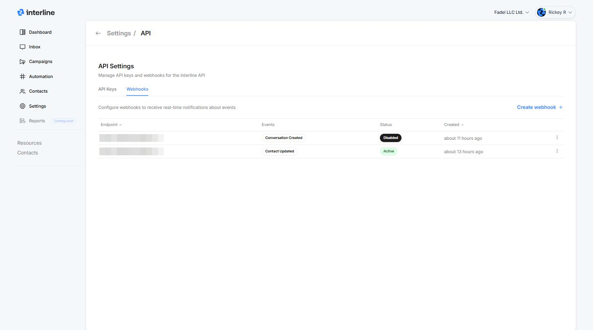
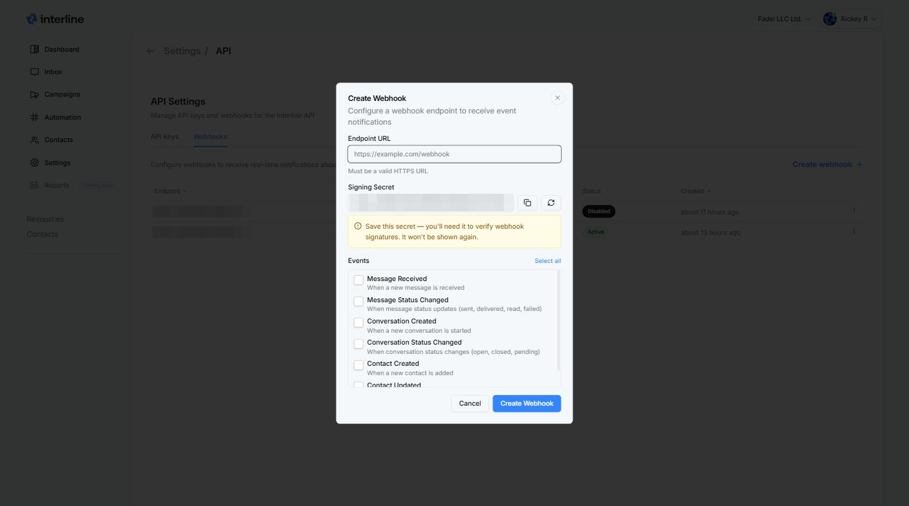

# Webhooks

Webhooks push real-time notifications to your server whenever something happens in Interline — a message arrives, a delivery status changes, a contact is updated — so you don't have to poll the API.

Manage them from the **Webhooks** tab in [**Settings → API**](https://app-ui.interline.chat/settings/api). The list shows each endpoint, the events it subscribes to, its status, and when it was created.

{ width="760" }

## Add a webhook

1. Go to [**Settings → API**](https://app-ui.interline.chat/settings/api) and open the **Webhooks** tab.
2. Click **Create webhook**.
3. Enter your **Endpoint URL** — it must be a valid **HTTPS** URL.
4. Copy the **Signing Secret** and store it safely (see below).
5. Tick the **Events** you want delivered to this endpoint (or **Select all**).
6. Click **Create Webhook**.

{ width="760" }

!!! warning "Save the signing secret — it's shown only once"
    The signing secret is what your server uses to verify that incoming webhook requests really came from Interline. Copy it before saving — it won't be shown again. Use the refresh button in the dialog to generate a new one if needed.

## Events

| Event | Fires when |
| --- | --- |
| **Message Received** | A new message is received |
| **Message Status Changed** | A message's status updates (sent, delivered, read, failed) |
| **Conversation Created** | A new conversation is started |
| **Conversation Status Changed** | A conversation's status changes (open, closed, pending) |
| **Contact Created** | A new contact is added |
| **Contact Updated** | A contact's information is modified |

## Manage webhooks

From the Webhooks list, use the **⋮** menu on any endpoint to disable, edit, or delete it. Disabled webhooks stay configured but stop receiving events until re-enabled.

Webhooks can also be managed programmatically — see the webhook endpoints in the [API Reference](reference.md) (requires a key with the **Read webhooks** / **Write webhooks** scopes).

## Payloads & verification

Delivery payload formats and signature verification details are documented in the [API Reference](reference.md).
